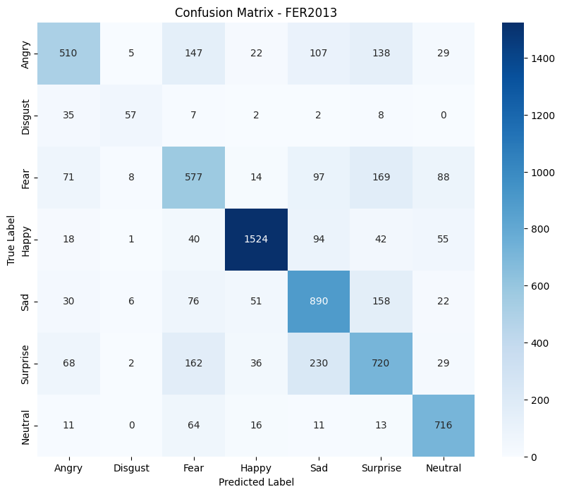

# Fine-Tuned Vision Transformer (ViT) for Facial Expression Recognition (FER) using OpenCV for Real-Time Recognition

This repository contains the code for fine-tuning a Vision Transformer (ViT) model on the [FER-2013 dataset](https://www.kaggle.com/datasets/msambare/fer2013) for Facial Expression Recognition (FER). The fine-tuned model is then integrated with OpenCV for real-time facial expression recognition through a webcam feed.

## Table of Contents
- [Introduction](#introduction)
- [Dataset](#dataset)
- [Model Architecture](#model-architecture)
- [Training & Fine-Tuning](#training--fine-tuning)
- [Real-Time Recognition](#real-time-recognition)
- [Results](#results)

## Introduction

Facial Expression Recognition (FER) is a critical task in the field of human-computer interaction, sentiment analysis, and emotion recognition. In this project, we fine-tune a pre-trained Vision Transformer (ViT) on the FER-2013 dataset to recognize facial expressions such as happiness, sadness, surprise, anger, and more. After fine-tuning, the model is integrated with OpenCV to perform real-time facial expression recognition using a webcam.

## Dataset

The FER-2013 dataset is used for training and fine-tuning. It contains 35,887 grayscale, 48x48 pixel images of facial expressions categorized into 7 classes: Angry, Disgust, Fear, Happy, Sad, Surprise and Neutral.
you can download the dataset [here](https://www.kaggle.com/datasets/msambare/fer2013).

## Model Architecture

The model used in this project is a Vision Transformer (ViT), a cutting-edge deep learning architecture for computer vision tasks. We use a pre-trained ViT model from the huggingface library and fine-tune it on the FER-2013 dataset for facial expression recognition.
you can download the model [here](https://huggingface.co/google/vit-base-patch16-224-in21k).

## Training & Fine-Tuning

To fine-tune the model on the FER-2013 dataset, we follow these steps:
1-Load the pre-trained ViT model.
2-Preprocess the FER-2013 dataset to be compatible with the model input.
3-Fine-tune the models.

## Real-Time Recognition

After fine-tuning, the model is saved and used for real-time recognition. The integration with OpenCV allows the system to capture webcam video, detect faces, and classify the emotion displayed by the face in real-time.

## Results

